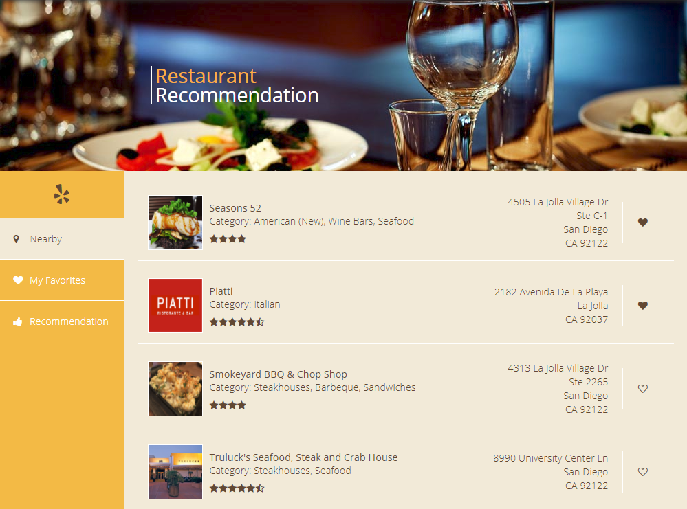

# YelpPlus 

Yelp+: Java Web Service Development – Event Search and Recommendation Engine 

A dynamic web page for users to search events and update preference with improved personalized event recommendation based on search history and favorite records 

Use of both traditional ER model database MySQL and distributive database MongoDB. Easy Switch between two implementations based on application 

## Getting Started

Clone repository from https://github.com/yaopang/YelpPlus.git   

Access the application with an open-source Java Servlet Container such as Apache tomcat. (ex: localhost://8080/Yelp) 

### Prerequisites
Apache Tomcat 7 or above  

MAMP 4.0  

MongoDB 3.6

## Functionality

Show nearby resturant based on device geolocation or ip address if geolocation info not available  

Set or unset favorite resturants 

Show favorite resturants (error message shown if no favorite restaurant selected) 

Content-based recommendation based on user favorite history. (restaurant category)

## ScreenShot

### Nearby Tag

### Favorite Tag

### Recommendation Tag

### Loading Screen

### Error Screen

 

## Authors and Contact

Shengyao Guo

nickyaopang1000@gmail.com

https://www.linkedin.com/in/shengyao-guo-887b99114/

